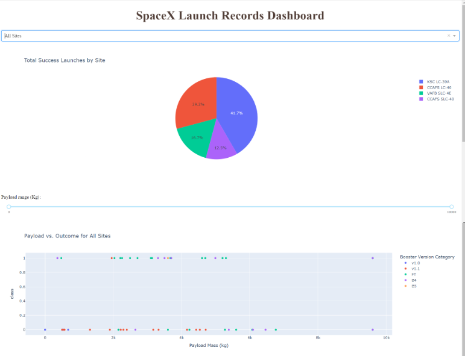

# Falcon 9 Landing Prediction (IBM Capstone)

[Portuguese (Brazil)](README.md)

Author: **Leonardo Henrique Ramos Ferreira**  
Course: **IBM Applied Data Science Capstone**

## Project Overview

This project analyzes whether the **Falcon 9 first stage** lands successfully.  
The workflow includes API data collection, web scraping, data wrangling, SQL and visual EDA, Folium geospatial analysis, a Dash dashboard, and classification models.

## Business Context

Reusable boosters reduce launch costs.  
By predicting landing success from mission variables (launch site, orbit, payload mass, booster version), it is possible to estimate operational risk more consistently.

## Data Sources

- Public SpaceX API
- Wikipedia launch tables (web scraping)
- Local processed datasets used in notebooks and dashboard

## Project Workflow (by notebook)

| Step | Notebook | Objective |
|---|---|---|
| 1 | `1. jupyter-labs-spacex-data-collection-api.ipynb` | Collect launch data through API |
| 2 | `2. jupyter-labs-webscraping.ipynb` | Extract complementary records via web scraping |
| 3 | `3. labs-jupyter-spacex-Data wrangling.ipynb` | Clean data and prepare analytical dataset |
| 4 | `4. jupyter-labs-eda-sql-coursera_sqllite.ipynb` | Perform EDA with SQL queries |
| 5 | `5. jupyter-labs-eda-dataviz.ipynb` | Perform visual EDA (patterns by site, payload, orbit) |
| 6 | `6. lab_jupyter_launch_site_location.ipynb` | Perform geospatial analysis with Folium |
| 7 | `7. SpaceX_Machine_Learning_Prediction_Part_5.jupyterlite.ipynb` | Train and evaluate classification models |

## Key Results

- SQL and visual EDA revealed different patterns across launch sites.
- Site, orbit, and payload mass influence landing outcome.
- Folium maps confirmed coastal concentration of launch infrastructure.
- Dash views (pie + scatter) improved comparison across sites and payload ranges.
- Best model in this run: **Decision Tree** with test accuracy around **0.9444**.

### Model Accuracy Comparison

| Model | Accuracy |
|---|---|
| Logistic Regression | 0.8333 |
| SVM | 0.8333 |
| Decision Tree | 0.9444 |
| KNN | 0.8333 |

## Repository Files

- `spacex_dash_app.py` - Interactive Plotly Dash app
- `spacex_launch_dash.csv` - Dataset used by the dashboard
- `spacex_launch_geo.csv` - Geospatial dataset used in Folium notebook
- `my_data1.db` - SQLite database used in SQL tasks
- `spacex_dash_app_screenshot.png` - Dashboard screenshot
- `DS-Capstone-Coursera.pdf` - Final presentation in PDF
- `ds-capstone-template-coursera.pptx` - Editable presentation source

## Dashboard Preview



## How to Run Locally

1. Install dependencies:

```bash
pip install pandas numpy matplotlib seaborn plotly dash folium scikit-learn sqlalchemy ipython-sql
```

2. Run notebooks in order (`1` to `7`).
3. Start the dashboard:

```bash
python spacex_dash_app.py
```

4. Open in your browser:

```text
http://127.0.0.1:8060
```

## Deliverables

- Final presentation: `DS-Capstone-Coursera.pdf`
- Presentation source: `ds-capstone-template-coursera.pptx`

## Presentation Format

- The template follows the course requirement with **54 slides**.
- The final version of the deck was made in **Portuguese and English**.
